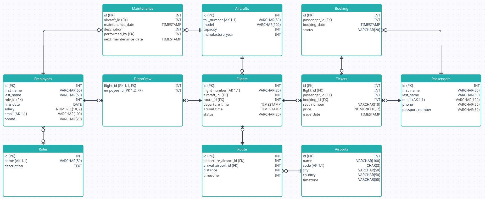

# Система управления авиакомпанией

# API Документация

---

## Самолеты

### Добавление самолета
**Ubuntu/Linux:**
```bash
curl -X POST http://localhost:8080/api/v1/aircraft \
  -H "Content-Type: application/json" \
  -d '{
    "tail_number": "RA-12345",
    "model": "Boeing 737",
    "capacity": 180,
    "manufacture_year": 2015
  }'
```
**Windows:**
```bash
curl -X POST http://localhost:8080/api/v1/aircraft ^
  -H "Content-Type: application/json" ^
  -d "{\"tail_number\": \"RA-12345\", \"model\": \"Boeing 737\", \"capacity\": 180, \"manufacture_year\": 2015}"
```

### Получение списка самолетов
```bash
curl -X GET http://localhost:8080/api/v1/aircrafts
```

### Получение информации о конкретном самолете
```bash
curl -X GET http://localhost:8080/api/v1/aircraft/1
```

### Удаление самолета
```bash
curl -X DELETE http://localhost:8080/api/v1/aircraft/1
```

---

## Сотрудники

### Добавление сотрудника
**Ubuntu/Linux:**
```bash
curl -X POST http://localhost:8080/api/v1/employee \
  -H "Content-Type: application/json" \
  -d '{
    "first_name": "John",
    "last_name": "Doe",
    "role_id": 1,
    "hire_date": "2023-03-10T00:00:00Z",
    "salary": 100000,
    "email": "john.doe@example.com",
    "phone": "+12345678901"
  }'
```
**Windows:**
```bash
curl -X POST http://localhost:8080/api/v1/employee ^
  -H "Content-Type: application/json" ^
  -d "{\"first_name\": \"John\", \"last_name\": \"Doe\", \"role_id\": 1, \"hire_date\": \"2023-03-10T00:00:00Z\", \"salary\": 100000, \"email\": \"john.doe@example.com\", \"phone\": \"+12345678901\"}"
```

### Получение списка сотрудников
```bash
curl -X GET http://localhost:8080/api/v1/employees
```

### Получение информации о конкретном сотруднике
```bash
curl -X GET http://localhost:8080/api/v1/employee/1
```

### Обновление данных сотрудника
**Ubuntu/Linux:**
```bash
curl -X PUT http://localhost:8080/api/v1/employee/1 \
  -H "Content-Type: application/json" \
  -d '{
    "first_name": "John",
    "last_name": "Doe",
    "role_id": 2,
    "hire_date": "2022-12-01T00:00:00Z",
    "salary": 120000,
    "email": "john.doe@example.com",
    "phone": "+12345678901"
  }'
```
**Windows:**
```bash
curl -X PUT http://localhost:8080/api/v1/employee/1 ^
  -H "Content-Type: application/json" ^
  -d "{\"first_name\": \"John\", \"last_name\": \"Doe\", \"role_id\": 2, \"hire_date\": \"2022-12-01T00:00:00Z\", \"salary\": 120000, \"email\": \"john.doe@example.com\", \"phone\": \"+12345678901\"}"
```

### Удаление сотрудника
```bash
curl -X DELETE http://localhost:8080/api/v1/employee/1
```

---

## Роли

### Добавление новой роли
**Ubuntu/Linux:**
```bash
curl -X POST http://localhost:8080/api/v1/role \
  -H "Content-Type: application/json" \
  -d '{
    "name": "КВС",
    "description": "Капитан воздушного судна"
  }'
```
**Windows:**
```bash
curl -X POST http://localhost:8080/api/v1/role ^
  -H "Content-Type: application/json" ^
  -d "{\"name\": \"КВС\", \"description\": \"Капитан воздушного судна\"}"
```

### Обновление роли по ID
**Ubuntu/Linux:**
```bash
curl -X PUT http://localhost:8080/api/v1/role/1 \
  -H "Content-Type: application/json" \
  -d '{
    "name": "КВС",
    "description": "Обновленное описание роли"
  }'
```
**Windows:**
```bash
curl -X PUT http://localhost:8080/api/v1/role/1 ^
  -H "Content-Type: application/json" ^
  -d "{\"name\": \"КВС\", \"description\": \"Обновленное описание роли\"}"
```

### Получение списка всех ролей
```bash
curl -X GET http://localhost:8080/api/v1/roles
```

### Получение роли по ID
```bash
curl -X GET http://localhost:8080/api/v1/role/1
```

### Удаление роли
```bash
curl -X DELETE http://localhost:8080/api/v1/role/1
```

---

## Аэропорты

### Добавление аэропорта
**Ubuntu/Linux:**
```bash
curl -X POST http://localhost:8080/api/v1/airport \
  -H "Content-Type: application/json" \
  -d '{
    "name": "Sheremetyevo International Airport",
    "code": "SVO",
    "city": "Moscow",
    "country": "Russia",
    "timezone": "Europe/Moscow"
  }'
```
**Windows:**
```bash
curl -X POST http://localhost:8080/api/v1/airport ^ 
  -H "Content-Type: application/json" ^ 
  -d "{\"name\": \"Sheremetyevo International Airport\", \"code\": \"SVO\", \"city\": \"Moscow\", \"country\": \"Russia\", \"timezone\": \"Europe/Moscow\"}"
```

### Обновление информации об аэропорте
**Ubuntu/Linux:**
```bash
curl -X PUT http://localhost:8080/api/v1/airport/1 \
  -H "Content-Type: application/json" \
  -d '{
    "name": "Updated Airport Name",
    "code": "NEW",
    "city": "Updated City",
    "country": "Updated Country",
    "timezone": "Europe/Updated"
  }'
```
**Windows:**
```bash
curl -X PUT http://localhost:8080/api/v1/airport/1 ^ 
  -H "Content-Type: application/json" ^ 
  -d "{\"name\": \"Updated Airport Name\", \"code\": \"NEW\", \"city\": \"Updated City\", \"country\": \"Updated Country\", \"timezone\": \"Europe/Updated\"}"
```

### Получение информации о конкретном аэропорте
```bash
curl -X GET http://localhost:8080/api/v1/airport/1
```

### Получение списка всех аэропортов
```bash
curl -X GET http://localhost:8080/api/v1/airports
```

### Удаление аэропорта
```bash
curl -X DELETE http://localhost:8080/api/v1/airport/1
```

---

## Маршруты

### Добавление маршрута
**Ubuntu/Linux:**
```bash
curl -X POST http://localhost:8080/api/v1/route \
  -H "Content-Type: application/json" \
  -d '{
    "departure_airport_id": 1,
    "arrival_airport_id": 2,
    "distance": 677,
    "duration_minutes": 94
  }'
```
**Windows:**
```bash
curl -X POST http://localhost:8080/api/v1/route ^ 
  -H "Content-Type: application/json" ^ 
  -d "{\"departure_airport_id\": 1, \"arrival_airport_id\": 2, \"distance\": 677, \"duration_minutes\": 94}"
```

### Обновление маршрута
**Ubuntu/Linux:**
```bash
curl -X PUT http://localhost:8080/api/v1/route/1 \
  -H "Content-Type: application/json" \
  -d '{
    "departure_airport_id": 1,
    "arrival_airport_id": 2,
    "distance": 677,
    "duration_minutes": 100
  }'
```
**Windows:**
```bash
curl -X PUT http://localhost:8080/api/v1/route/1 ^ 
  -H "Content-Type: application/json" ^ 
  -d "{\"departure_airport_id\": 1, \"arrival_airport_id\": 2, \"distance\": 677, \"duration_minutes\": 100}"
```

### Получение списка всех маршрутов
```bash
curl -X GET http://localhost:8080/api/v1/routes
```

### Получение маршрута по ID
```bash
curl -X GET http://localhost:8080/api/v1/route/1
```

### Получение маршрутов для конкретного аэропорта
```bash
curl -X GET http://localhost:8080/api/v1/routes/airport/1
```

### Удаление маршрута
```bash
curl -X DELETE http://localhost:8080/api/v1/route/1
```

---

## Рейсы

### Добавление рейса
**Ubuntu/Linux:**
```bash
curl -X POST http://localhost:8080/api/v1/flight \
  -H "Content-Type: application/json" \
  -d '{
    "flight_number": "SU123",
    "aircraft_id": 1,
    "route_id": 2,
    "departure_time": "2023-04-01T10:00:00Z",
    "arrival_time": "2023-04-01T14:00:00Z",
    "status": "scheduled"
  }'
```
**Windows:**
```bash
curl -X POST http://localhost:8080/api/v1/flight ^ 
  -H "Content-Type: application/json" ^ 
  -d "{\"flight_number\": \"SU123\", \"aircraft_id\": 1, \"route_id\": 2, \"departure_time\": \"2023-04-01T10:00:00Z\", \"arrival_time\": \"2023-04-01T14:00:00Z\", \"status\": \"scheduled\"}"
```

### Обновление рейса
**Ubuntu/Linux:**
```bash
curl -X PUT http://localhost:8080/api/v1/flight/1 \
  -H "Content-Type: application/json" \
  -d '{
    "flight_number": "SU123",
    "aircraft_id": 1,
    "route_id": 2,
    "departure_time": "2023-04-01T10:00:00Z",
    "arrival_time": "2023-04-01T14:00:00Z",
    "status": "departed"
  }'
```
**Windows:**
```bash
curl -X PUT http://localhost:8080/api/v1/flight/1 ^ 
  -H "Content-Type: application/json" ^ 
  -d "{\"flight_number\": \"SU123\", \"aircraft_id\": 1, \"route_id\": 2, \"departure_time\": \"2023-04-01T10:00:00Z\", \"arrival_time\": \"2023-04-01T14:00:00Z\", \"status\": \"departed\"}"
```

### Получение списка всех рейсов
```bash
curl -X GET http://localhost:8080/api/v1/flights
```

### Получение рейса по ID
```bash
curl -X GET http://localhost:8080/api/v1/flight/1
```

### Получение рейсов по маршруту (Route ID)
```bash
curl -X GET http://localhost:8080/api/v1/flights/route/2
```

### Получение рейсов для самолёта (Aircraft ID)
```bash
curl -X GET http://localhost:8080/api/v1/flights/aircraft/1
```

### Получение рейсов для аэропорта (Airport ID)
```bash
curl -X GET http://localhost:8080/api/v1/flights/airport/1
```

### Удаление рейса
```bash
curl -X DELETE http://localhost:8080/api/v1/flight/1
```

---

## Пассажиры

### Добавление пассажира
**Ubuntu/Linux:**
```bash
curl -X POST http://localhost:8080/api/v1/passenger \
  -H "Content-Type: application/json" \
  -d '{
    "first_name": "Alice",
    "last_name": "Smith",
    "email": "alice.smith@example.com",
    "phone": "+12345678901",
    "passport_number": "AB1234567"
  }'
```
**Windows:**
```bash
curl -X POST http://localhost:8080/api/v1/passenger ^
  -H "Content-Type: application/json" ^
  -d "{\"first_name\": \"Alice\", \"last_name\": \"Smith\", \"email\": \"alice.smith@example.com\", \"phone\": \"+12345678901\", \"passport_number\": \"AB1234567\"}"
```

### Получение списка всех пассажиров
```bash
curl -X GET http://localhost:8080/api/v1/passengers
```

### Получение пассажира по ID
```bash
curl -X GET http://localhost:8080/api/v1/passenger/1
```

### Обновление данных пассажира
**Ubuntu/Linux:**
```bash
curl -X PUT http://localhost:8080/api/v1/passenger/1 \
  -H "Content-Type: application/json" \
  -d '{
    "first_name": "Alice",
    "last_name": "Smith",
    "email": "alice.new@example.com",
    "phone": "+12345678902",
    "passport_number": "AB1234567"
  }'
```
**Windows:**
```bash
curl -X PUT http://localhost:8080/api/v1/passenger/1 ^
  -H "Content-Type: application/json" ^
  -d "{\"first_name\": \"Alice\", \"last_name\": \"Smith\", \"email\": \"alice.new@example.com\", \"phone\": \"+12345678902\", \"passport_number\": \"AB1234567\"}"
```

### Удаление пассажира
```bash
curl -X DELETE http://localhost:8080/api/v1/passenger/1
```

---

## Бронирования

### Создание бронирования
**Ubuntu/Linux:**
```bash
curl -X POST http://localhost:8080/api/v1/booking \
  -H "Content-Type: application/json" \
  -d '{
    "passenger_id": 1,
    "booking_date": "2023-05-01T12:00:00Z",
    "status": "pending"
  }'
```
**Windows:**
```bash
curl -X POST http://localhost:8080/api/v1/booking ^
  -H "Content-Type: application/json" ^
  -d "{\"passenger_id\": 1, \"booking_date\": \"2023-05-01T12:00:00Z\", \"status\": \"pending\"}"
```

### Обновление бронирования
**Ubuntu/Linux:**
```bash
curl -X PUT http://localhost:8080/api/v1/booking/1 \
  -H "Content-Type: application/json" \
  -d '{
    "passenger_id": 1,
    "booking_date": "2023-05-01T12:00:00Z",
    "status": "confirmed"
  }'
```
**Windows:**
```bash
curl -X PUT http://localhost:8080/api/v1/booking/1 ^
  -H "Content-Type: application/json" ^
  -d "{\"passenger_id\": 1, \"booking_date\": \"2023-05-01T12:00:00Z\", \"status\": \"confirmed\"}"
```

### Получение бронирования по ID
```bash
curl -X GET http://localhost:8080/api/v1/booking/1
```

### Получение списка всех бронирований
```bash
curl -X GET http://localhost:8080/api/v1/bookings
```

### Получение бронирований для конкретного пассажира
```bash
curl -X GET http://localhost:8080/api/v1/bookings/passenger/1
```

### Удаление бронирования
```bash
curl -X DELETE http://localhost:8080/api/v1/booking/1
```

---

## Билеты

### Создание билета
**Ubuntu/Linux:**
```bash
curl -X POST http://localhost:8080/api/v1/ticket \
  -H "Content-Type: application/json" \
  -d '{
    "flight_id": 1,
    "passenger_id": 2,
    "booking_id": 3,
    "seat_number": "12A",
    "price": 250.00
  }'
```
**Windows:**
```bash
curl -X POST http://localhost:8080/api/v1/ticket ^
  -H "Content-Type: application/json" ^
  -d "{\"flight_id\": 1, \"passenger_id\": 2, \"booking_id\": 3, \"seat_number\": \"12A\", \"price\": 250.00}"
```

### Обновление билета
**Ubuntu/Linux:**
```bash
curl -X PUT http://localhost:8080/api/v1/ticket/1 \
  -H "Content-Type: application/json" \
  -d '{
    "flight_id": 1,
    "passenger_id": 2,
    "booking_id": 3,
    "seat_number": "12B",
    "price": 260.00,
    "issue_date": "2023-05-01T12:00:00Z"
  }'
```
**Windows:**
```bash
curl -X PUT http://localhost:8080/api/v1/ticket/1 ^
  -H "Content-Type: application/json" ^
  -d "{\"flight_id\": 1, \"passenger_id\": 2, \"booking_id\": 3, \"seat_number\": \"12B\", \"price\": 260.00, \"issue_date\": \"2023-05-01T12:00:00Z\"}"
```

### Получение билета по ID
```bash
curl -X GET http://localhost:8080/api/v1/ticket/1
```

### Получение списка всех билетов
```bash
curl -X GET http://localhost:8080/api/v1/tickets
```

### Получение билетов для конкретного пассажира
```bash
curl -X GET http://localhost:8080/api/v1/tickets/passenger/2
```

### Получение билетов на рейс по ID рейса
```bash
curl -X GET http://localhost:8080/api/v1/tickets/flight/1
```

### Получение билетов в бронировании по ID бронирования
```bash
curl -X GET http://localhost:8080/api/v1/tickets/booking/3
```

### Удаление билета
```bash
curl -X DELETE http://localhost:8080/api/v1/ticket/1
```

---

## Техническое обслуживание

### Создание записи обслуживания
**Ubuntu/Linux:**
```bash
curl -X POST http://localhost:8080/api/v1/maintenance \
  -H "Content-Type: application/json" \
  -d '{
    "aircraft_id": 1,
    "maintenance_date": "2023-06-01T10:00:00Z",
    "description": "Профилактический осмотр",
    "performed_by": 2,
    "next_maintenance_date": "2023-12-01T10:00:00Z"
  }'
```
**Windows:**
```bash
curl -X POST http://localhost:8080/api/v1/maintenance ^
  -H "Content-Type: application/json" ^
  -d "{\"aircraft_id\": 1, \"maintenance_date\": \"2023-06-01T10:00:00Z\", \"description\": \"Профилактический осмотр\", \"performed_by\": 2, \"next_maintenance_date\": \"2023-12-01T10:00:00Z\"}"
```

### Обновление записи обслуживания
**Ubuntu/Linux:**
```bash
curl -X PUT http://localhost:8080/api/v1/maintenance/1 \
  -H "Content-Type: application/json" \
  -d '{
    "aircraft_id": 1,
    "maintenance_date": "2023-06-01T10:00:00Z",
    "description": "Обновленный комментарий",
    "performed_by": 2,
    "next_maintenance_date": "2023-12-15T10:00:00Z"
  }'
```
**Windows:**
```bash
curl -X PUT http://localhost:8080/api/v1/maintenance/1 ^
  -H "Content-Type: application/json" ^
  -d "{\"aircraft_id\": 1, \"maintenance_date\": \"2023-06-01T10:00:00Z\", \"description\": \"Обновленный комментарий\", \"performed_by\": 2, \"next_maintenance_date\": \"2023-12-15T10:00:00Z\"}"
```

### Получение обслуживания по ID
```bash
curl -X GET http://localhost:8080/api/v1/maintenance/1
```

### Получение списка всех обслуживаний
```bash
curl -X GET http://localhost:8080/api/v1/maintenances
```

### Получение обслуживаний для конкретного самолёта
```bash
curl -X GET http://localhost:8080/api/v1/maintenances/aircraft/1
```

### Получение обслуживаний, проведенных конкретным сотрудником
```bash
curl -X GET http://localhost:8080/api/v1/maintenances/employee/2
```

### Удаление обслуживания
```bash
curl -X DELETE http://localhost:8080/api/v1/maintenance/1
```

---

## Экипажи (FlightCrew)

### Назначение сотрудника на рейс
**Ubuntu/Linux:**
```bash
curl -X POST http://localhost:8080/api/v1/flightcrew \
  -H "Content-Type: application/json" \
  -d '{
    "flight_id": 1,
    "employee_id": 2
  }'
```
**Windows:**
```bash
curl -X POST http://localhost:8080/api/v1/flightcrew ^
  -H "Content-Type: application/json" ^
  -d "{\"flight_id\": 1, \"employee_id\": 2}"
```

### Удаление сотрудника с рейса
_В данном случае удаление производится по query-параметрам `flight_id` и `employee_id`:_
```bash
curl -X DELETE "http://localhost:8080/api/v1/flightcrew?flight_id=1&employee_id=2"
```

### Получение списка сотрудников на рейсе по ID рейса
```bash
curl -X GET http://localhost:8080/api/v1/flightcrew/flight/1
```

### Получение списка рейсов, на которых закреплён сотрудник (по ID сотрудника)
```bash
curl -X GET http://localhost:8080/api/v1/flightcrew/employee/2
```
